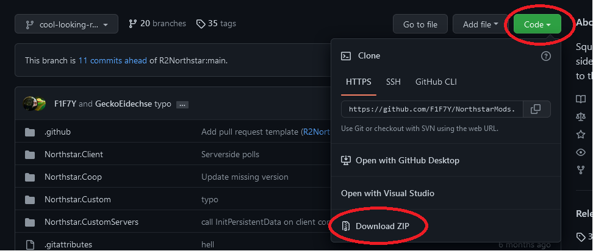

# Testing


This section is very much still WIP. Feel free to help expand it.


## Developers & Contributors

This section applies to you if you're opening a pull request to any of the Northstar repos.

Whatever your change includes, whether a bug fix or a new feature make sure to test it appropriately.

This means if your change is a bug fix, it's recommend you first make sure you can reproduce the bug. Then after making the necessary changes to fix it, test it using the same method you used to originally confirm the bug.\
When you're opening a pull request, make sure to mention how to reproduce the bug, so that reviewers can confirm that your chance indeed fixed the issue.

If your change is a new feature, make sure to test both that the newly added functionality performs as expected, as well as ensuring that it doesn't introduce any form of regression bugs. This means, testing anything that might be affected by your new feature.

## Maintainers

This section applies to you if you're someone who's able to merge PRs in any of the repos of the Northstar GitHub org as well as when simplying performing reviews, even without being able to actually merge a PR.

When reviewing pull requests on GitHub, make sure to checkout the changes made by a PR locally and test it there. In particular, test the parts of the code that are touched by a PR.

After testing, make sure to mention the steps tested in your review.

## Acquiring necessary files

### NorthstarLauncher

TODO

### NorthstarMods

Click on the source branch of the PR


Click on _"Code"_ and then on _"Download ZIP"_



From there copy over all the `Northstar.XXXXX` folders into your mods folder in your TItnafall2 install the same way you would manually install mods.

## Tips and toolkits

(might require `sv_cheats 1`)

**Spawn titan/grunt:**

* For titan: `ent_create npc_titan; ent_fire !picker setteam 2`
* For grunt: `ent_create npc_soldier; ent_fire !picker setteam 2`

**Add fake lag for network testing**

`net_fakelag 200` -> 200ms network lag

```
] find net_fake
[info] "net_fakelag" = "0" ( CHEAT ) - Lag all incoming network data (including loopback) by this many milliseconds.
[info] "net_fakeloss" = "0" - Simulate packet loss as a percentage (negative means drop 1/n packets)
[info] "net_fakelag_clientOnly" = "1" ( CHEAT ) - Fakelag won't affect the server, only clients
[info] "net_fakelagjitter" = "0" - Jitter net_fakelag packet time
```

**Joining same server multiple times with same accounts**

By default duplicate accounts are blocked by server. Use `-allowdupeaccounts` when starting server to allow duplicate accounts. From there you can launch multiple clients on the same account and connect them to the server.

**Quickly switch map**

Use `map <map name>` to quickly switch map.\
Example: `map mp_glitch`

List of maps can be found [here](../hosting-a-server-with-northstar/dedicated-server/#maps)

**Speed-up/slow-down game**

Use `host_timescale <factor>` to speed-up or slow-down the game.\
For example `host_timescale 10` speeds up game by factor of `10`. Set to `1` to go back to default.
